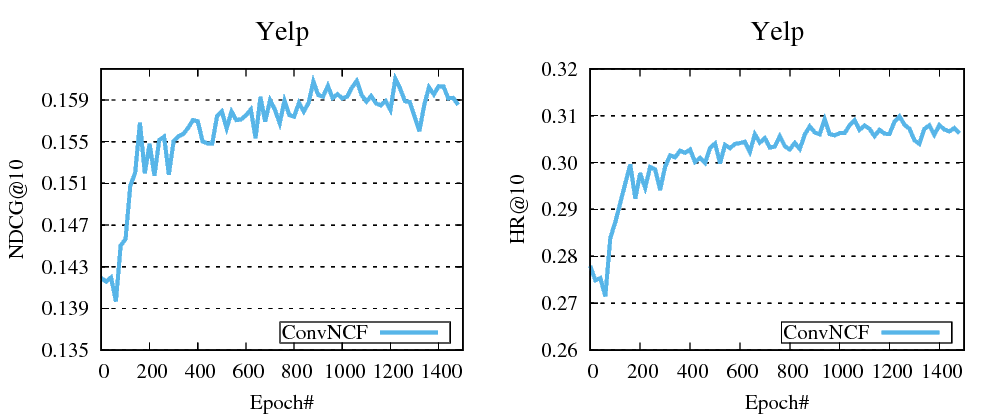

# Outer Product-based Neural Collaborative Filtering

Convolutional Neural Collaborative Filtering performs well based on outer product of user and item embeddings. This is our official implementation for the paper: 

Xiangnan He, Xiaoyu Du, Xiang Wang, Feng Tian, Jinhui Tang, Tat-Seng Chua, **Outer Product-based Neural Collaborative Filtering**, In Proceedings of IJCAI'18.

If you use the codes, please cite our paper . Thanks!

# Requirements

- Tensorflow 1.7
- numpy, scipy

# Quick Start



0. decompress the data files.
    ```
    cd Data
    gunzip *
    ```

1. Pretrain the embeddings using MF_BPR with

    ```
    python MF_BPR.py
    ```

2. Train ConvNCF with pretrained embeddings

    ```
    python ConvNCF.py --pretrain=1
    ```


# Dataset


We provide three processed datasets: Yelp(yelp), MovieLens 1 Million (ml-1m) and Pinterest (pinterest-20) in Data/

### train.rating:

Train file.

Each Line is a training instance: 

`userID\t itemID\t rating\t timestamp (if have)`

### test.rating:

Test file (positive instances).
Each Line is a testing instance: 

`userID\t itemID\t rating\t timestamp (if have)`

### test.negative

Test file (negative instances).
Each line corresponds to the line of test.rating, containing 999 negative samples.
Each line is in the format: 

`(userID,itemID)\t negativeItemID1\t negativeItemID2 ...`

# Files

- Data. Training and testing data.
    - yelp.train.rating. Rating of training data.
    - yelp.test.rating. Rating of testing data.
    - yelp.test.negative. 1000 testing samples for each user. (0,32) means this row is for user 0 and the positive test item is 32.
- Dataset.py. Module preprocessing data.
- saver.py. Module saving parameters.
- MF_BPR.py. MF model with BPR loss.
- ConvNCF.py. Our model.
